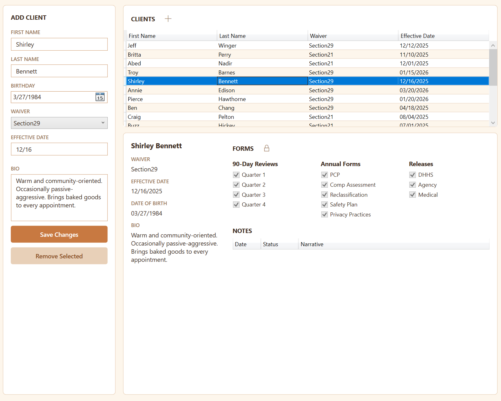

# Sati — Case Management for Social Services

Sati is a desktop case management application built for social services case managers. 
It helps track clients, document visits and contacts, monitor compliance deadlines, 
and calculate monthly productivity — all in one focused tool designed for daily use.

The name comes from the Pali word for mindfulness and remembrance, reflecting the 
app's purpose: keeping what matters present and accounted for.

---

## Features

**Client Management**
- Add and manage a caseload of clients with biographical info, waiver type, and effective dates
- Per-client compliance checklists tracking annual forms and quarterly reviews
- Automatic form deadline generation based on each client's effective date

**Notes & Documentation**
- Log visits, contacts, and documentation notes with date, status, and unit count
- Note templates auto-populate based on note type and form selection
- Status workflow: Scheduled → Pending → Logged, with automatic abandonment after a configurable threshold
- Full-text search and status filtering across all notes

**Productivity Tracking**
- Monthly unit totals broken down by status (Pending, Logged, Abandoned)
- Estimated incentive calculation based on logged units
- Workday scheduler for marking scheduled and excluded days

**Upcoming Events Dashboard**
- Automatically surfaces approaching form deadlines, scheduled visits, and scheduled contacts
- Sortable by date or event type

**Scratchpad**
- A persistent daily work log that auto-saves on close
- Full history browser with search across all previous entries

**Settings**
- Configurable abandonment threshold, productivity targets, incentive rates, and note templates
- Holiday and weekday exclusions for the workday scheduler

---

## Tech Stack

Sati is a WPF desktop application targeting .NET 10 on Windows.

- **UI Framework:** WPF with strict MVVM architecture
- **MVVM:** CommunityToolkit.Mvvm (ObservableObject, RelayCommand, ObservableValidator)
- **Data Access:** Entity Framework Core 10 with SQL Server LocalDB
- **Dependency Injection:** Microsoft.Extensions.DependencyInjection via IHost
- **Database:** SQL Server LocalDB (local), designed for Azure SQL migration

The architecture follows strict separation of concerns — ViewModels have no knowledge 
of Views, services are injected via constructor DI, and window creation uses the 
factory delegate pattern throughout.

---

## Screenshots

---

## Setup

Sati requires .NET 10 and SQL Server LocalDB (included with Visual Studio).

1. Clone the repository
2. Copy `appsettings.template.json` to `appsettings.json` in the project root. The real
   file is gitignored because it holds the connection string, so a fresh clone has no
   configuration and startup fails at the first database call
3. Open `Sati.slnx` in Visual Studio 2022 or later
4. The database will be created and migrated automatically on first run
5. On first launch Sati opens a **Create Administrator** window and will not continue past
   it. Sati never runs against a database with no administrator, because the role editor
   itself sits behind an administrator-gated tab — a database with no admin could never
   grow one from inside the app
6. Sign in as that administrator. Additional users are created from the login screen and
   assigned roles from Supervisor → User Management

The template's default connection string targets SQL Server LocalDB
(`(localdb)\MSSQLLocalDB`) and needs no further changes for local development.

Maintenance scripts live in [`Tools/`](Tools/README.md) — migration-chain and schema-drift
checks to run before a release, and an account recovery script.

---

## Status

Sati is under active development. Core workflows are complete and in daily use. 
Planned future work includes Azure SQL migration, Microsoft Entra ID authentication, 
and MSIX packaging for deployment.

---

## About

Built by Josh — a social services case manager with a background in software 
development — as both a practical daily tool and a portfolio project demonstrating 
modern .NET desktop application architecture.
